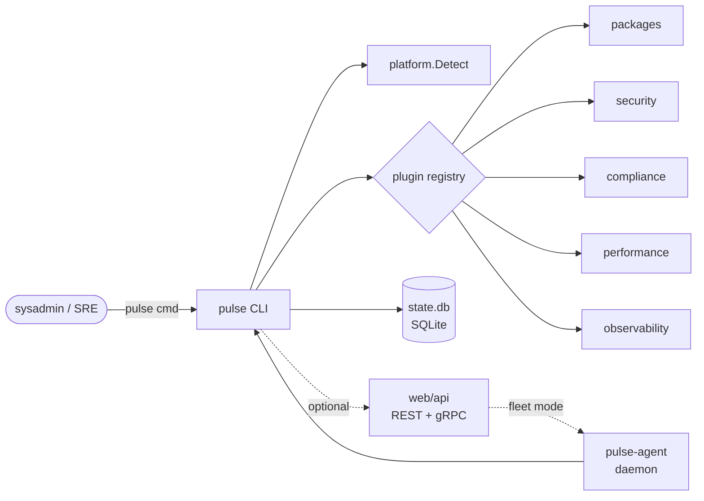

<!-- KEYWORDS: linux maintenance, cross-distro, package manager, apt, dnf, pacman, zypper, apk, ubuntu, debian, fedora, arch, opensuse, alpine, rhel, rocky, sysadmin tooling, devops cli, sre tooling, fleet management, system update, security audit, vulnerability scan, cleanup, rollback, dry-run, plugin architecture, go cli, single binary, agent daemon, grpc, helm chart, kubernetes, terraform provider, ansible, homelab, server maintenance, patch management, compliance, observability, performance tuning, idempotent operations, declarative maintenance, unattended upgrades, snapshot, transactional update, audit trail, fleet operator -->

<div align="center">

# OCTALUM-PULSE

**Cross-distro Linux maintenance CLI — update, audit, rollback, repeat.**

[](https://github.com/Harery/OCTALUM-PULSE/actions/workflows/ci.yml)
[](LICENSE)
[](go.mod)
[](.goreleaser.yml)
[](https://github.com/Harery/OCTALUM-PULSE/stargazers)
[](https://asciinema.org/~harery)

</div>

> Pulse keeps Linux fleets healthy across distros — update, audit, rollback, repeat — with the same dry-run-first discipline an SRE applies to production.

<p align="right"><sub><code>DRAWING NO. 03.00  ·  REV. 2026.05  ·  SHEET 03 OF 05</code></sub></p>

[The problem](#the-problem) · [Install](#install) · [Quickstart](#quickstart) · [Distro support](#distro-support) · [How it works](#how-it-works) · [Comparison](#comparison) · [FAQ](#faq) · [Documentation](#documentation) · [Roadmap](#roadmap)

## The problem

Linux maintenance is the same chore on every box and a different command on every distro. `apt`, `dnf`, `pacman`, `zypper`, `apk` each have their own flags, log formats, and failure modes. Audit, cleanup, and rollback split across distro-specific scripts that drift over time. Pulse gives one binary, one command set, dry-run by default, and an audit trail you can roll back.

## Install

```bash
curl -fsSL https://raw.githubusercontent.com/Harery/OCTALUM-PULSE/main/scripts/install.sh | sh
```

## Quickstart

```bash
pulse doctor                       # detect distro, package manager, init system, kernel
pulse update --smart --dry-run     # preview upgrades without touching the system
pulse security audit               # CVE scan against installed packages
```

## What you get

A single static Go binary (`pulse`) plus an optional agent daemon (`pulse-agent`) for fleet mode.

```text
$ pulse doctor
OS: linux | Distro: ubuntu 24.04 | PM: apt | Init: systemd | Arch: amd64 | Kernel: 6.8.0
ok  package manager reachable
ok  state DB writable (~/.local/state/pulse/state.db)
ok  plugins loaded: packages, security, compliance, performance, observability
```

Releases ship for `linux/amd64` and `linux/arm64` via goreleaser, plus `.deb`, `.rpm`, `.apk`, a Helm chart (`helm/`), Kubernetes manifests (`k8s/`), Docker images (`docker/`), Ansible role (`ansible/`), and a Terraform provider scaffold (`contrib/`).

## Distro support

Verified against `internal/platform/detect.go`. Rows mark distros where the package-manager backend is wired and tested.

| Distro | update | cleanup | security audit | optimization | rollback |
|:--|:--:|:--:|:--:|:--:|:--:|
| Ubuntu | yes | yes | yes | yes | yes |
| Debian | yes | yes | yes | yes | yes |
| Fedora | yes | yes | yes | yes | yes |
| RHEL / CentOS | yes | yes | yes | yes | yes |
| Rocky / AlmaLinux | yes | yes | yes | yes | yes |
| Arch / Manjaro | yes | yes | yes | yes | partial |
| openSUSE (Leap / Tumbleweed) | yes | yes | yes | yes | yes |
| Alpine | yes | yes | partial | yes | partial |
| NixOS | partial | no | partial | no | partial |

Pop!_OS, Linux Mint, and EndeavourOS inherit their parent distro's backend through the `ID_LIKE` fallback in `detect.go`.

## How it works



The CLI reads `/etc/os-release` via `platform.Detect`, loads plugins from `internal/plugin`, executes the requested action through the matching package-manager backend, and records every transaction in a SQLite state DB so `pulse rollback` can replay or invert it. The optional `web/api` package exposes the same operations over REST and gRPC; `pulse-agent` runs that API on remote hosts for fleet control.

## Comparison

|  | Pulse | topgrade | Cockpit | Ansible Roles | chezmoi / dotbot |
|:--|:--:|:--:|:--:|:--:|:--:|
| Cross-distro single binary | yes | yes | partial | yes (controller) | yes |
| Dry-run first | yes | partial | no | yes (check mode) | yes |
| Built-in rollback / state DB | yes | no | no | manual | partial |
| Agent / fleet mode | yes (gRPC) | no | yes (web) | yes (push) | no |
| License | MIT | GPL-3.0 | LGPL-2.1 | GPL-3.0 | MIT / Apache-2.0 |

## FAQ

### What distros does it support?

Nine families with first-class backends: Ubuntu, Debian, Fedora, RHEL, Rocky / AlmaLinux, Arch / Manjaro, openSUSE (Leap and Tumbleweed), Alpine. Derivatives (Pop!_OS, Mint, EndeavourOS) inherit through `ID_LIKE`. NixOS detection works; declarative actions are partial.

### Is it safe to run unattended?

Yes. Every mutating command runs in dry-run by default. Pass `--apply` (or `--yes` for batch use) to commit. Mutations journal to SQLite so a failed transaction rolls back cleanly. CI runs the suite at 47.3% coverage; `web/api` is at 96%, `pkg/client` at 91%.

### How is this different from topgrade?

Topgrade fans out to existing updaters and exits. Pulse owns the operation: one command surface, plugin architecture (`security`, `compliance`, `performance`, `observability`), a persistent state DB, rollback, and an agent mode. Topgrade fits one laptop; Pulse fits many machines.

### How do I roll back?

```bash
pulse history          # list recorded transactions
pulse rollback <id>    # revert a specific run
```

Rollback uses the state DB and the package manager's own transaction log where available (`dnf history`, `zypper rollback`, btrfs snapshots when present).

### Can I use it on a fleet?

Run `pulse-agent` on each host. The agent exposes the gRPC API defined in `web/api`. Drive it from a controller, the Helm chart in `helm/`, the Ansible role in `ansible/`, or the Terraform provider scaffold in `contrib/`.

### Is there a TUI?

`pulse tui` opens an interactive view over the same plugin set. Use it to explore on a single host before scripting actions for a fleet.

## Documentation

- Docs site: [`docs/`](docs/)
- Examples: [`examples/`](examples/)
- Plugin SDK: [`internal/plugin/`](internal/plugin/) plus the five reference plugins under [`plugins/`](plugins/)
- Roadmap: [`ROADMAP.md`](ROADMAP.md)
- Changelog: [`CHANGELOG.md`](CHANGELOG.md)
- Security policy: [`SECURITY.md`](SECURITY.md)
- Marketing & social: [`MARKETING.md`](MARKETING.md), [`SOCIAL_PREVIEW.md`](SOCIAL_PREVIEW.md)

## Roadmap

- 2026-Q2 — NixOS first-class backend (declarative + rollback parity)
- 2026-Q2 — Signed plugin registry and supply-chain attestations (SLSA L3)
- 2026-Q3 — Web UI for `pulse-agent` fleets (read-only dashboard, then actions)
- 2026-Q3 — eBPF-backed observability plugin (no extra daemon)
- 2026-Q4 — OpenTelemetry exporter for every transaction
- 2027-Q1 — Stable v3 plugin ABI and out-of-tree plugin marketplace

## Contributing · License · Security

- Contributions: see [`CONTRIBUTING.md`](CONTRIBUTING.md) and [`GOVERNANCE.md`](GOVERNANCE.md).
- License: [MIT](LICENSE).
- Vulnerabilities: report privately per [`SECURITY.md`](SECURITY.md).
<!-- ============================================================== -->
<!-- UNIFIED OCTALUM FAMILY FOOTER — keep verbatim across every repo -->
<!-- ============================================================== -->

---

<div align="center">

### Drawn by the same hand

A working portfolio of digital infrastructure, designed and maintained by [**Mohamed Harery**](https://harery.com) — Architect of Digital Systems.

| Sheet | Repo | What it is |
|:--:|:--|:--|
| 00 | [**harery.com**](https://github.com/Harery/Mo) | The studio — portfolio, ledger, contact |
| 01 | [**OCTALUME**](https://github.com/Harery/OCTALUME) | 8-phase enterprise SDLC framework |
| 02 | [**OCTALUM-PYLAB**](https://github.com/Harery/OCTALUM-PYLAB) | Python DSA & coding-interview prep |
| 03 | [**OCTALUM-PULSE**](https://github.com/Harery/OCTALUM-PULSE) | Cross-distro Linux maintenance CLI |
| 04 | [**octalum-bdtb**](https://github.com/Harery/octalum-bdtb) | 12-stage Claude Code Skill — brain-dump → product |

<sub>
  <a href="https://harery.com">harery.com</a> ·
  <a href="https://github.com/Harery">github.com/Harery</a> ·
  <a href="https://www.linkedin.com/in/harery/">LinkedIn</a>
</sub>

<sub>BLUEPRINT · drawn 2026 · MIT-licensed code · all drawings reserved</sub>

</div>
